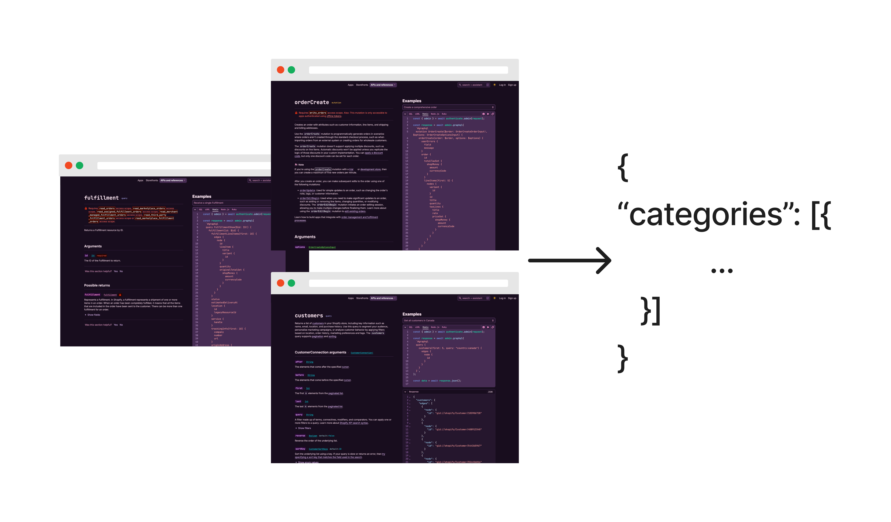
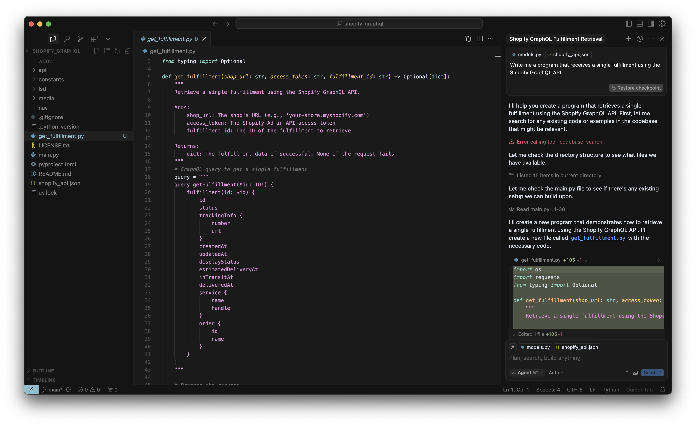

# shopify graphql



This project mines Shopify API docs for the spec to their GraphQL API using [LSD](https://lsd.so).

## Contents

* [Give me the data](#give-me-the-data)
  * [Step by step](#step-by-step)
  * [Getting the data yourself](#getting-the-data-yourself)
* [Help me vibe code this](#help-me-vibe-code-this)
* [Mining Shopify GraphQL yourself](#mining-shopify-graphql-yourself)
* [Mining](#mining)
* [LSD Cache](#lsd-cache)

## Give me the data

If you're interested in the Shopify GraphQL being programmatically accessible, the two files you'd be most interested in are:

* [`api/models.py`](https://github.com/lsd-so/Shopify-GraphQL-Spec/blob/main/api/models.py) -> Where the [Pydantic](https://docs.pydantic.dev/latest/) models for the GraphQL operations are defined
* [`shopify_api.json`](https://github.com/lsd-so/Shopify-GraphQL-Spec/blob/main/shopify_api.json) -> Where the Shopify GraphQL spec can be viewed as a JSON with code examples included.
  * This is structured as a [`ShopifyAPI` object](https://github.com/lsd-so/Shopify-GraphQL-Spec/blob/main/api/models.py#L96)

### Step by step

1. Clone this repo

```bash
$ git clone https://github.com/lsd-so/Shopify-GraphQL-Spec.git
```

2. Just run the [`main.py` file](https://github.com/lsd-so/Shopify-GraphQL-Spec/blob/main/main.py)

```bash
$ uv run main.py
```

### Getting the data yourself

If you'd like to get the data yourself or update to match a new version of the Shopify API, then [continue reading to learn how](#mining-shopify-graphql-yourself).

## Help me vibe code this



LLMs are already familiar with GraphQL so this gives them the ability to understand Shopify's GraphQL specifically.

1. Download the [JSON file](https://github.com/lsd-so/Shopify-GraphQL-Spec/blob/main/shopify_api.json) and [Python models](https://github.com/lsd-so/Shopify-GraphQL-Spec/blob/main/api/models.py)
2. Place both the JSON file and Python file in your repo
   2b. Make sure you are using the `models.py` file in `api/`!
3. Go to Cursor, click "New chat", click "Add context", click "Files & folders", and add both files to your context
4. Vibe code with Cursor now understanding how to use the Shopify GraphQL API

## Mining Shopify GraphQL yourself

Set the `LSD_USER` and `LSD_API_KEY` environment variables using [your authenticated credentials](https://lsd.so/profile).

```
$ export LSD_USER='your@email.domain'
$ export LSD_API_KEY='<api key from profile>'
```

And update the [`main.py` file](https://github.com/lsd-so/Shopify-GraphQL-Spec/blob/main/main.py) file to `get_data()` instead of `print_data()`

```diff
def main():
-    # get_data()
+     get_data()
-    print_data()
+    # print_data()
```

## Mining

Use [uv](https://docs.astral.sh/uv/getting-started/installation/):

```bash
$ uv run main.py
```

And there ya go.

## LSD Cache

When running this python project, it involves querying the same page more than once for different groups of elements (such as in [here](https://github.com/lsd-so/Shopify-GraphQL-Spec/blob/main/api/fields_and_connections.py#L28) or [here](https://github.com/lsd-so/Shopify-GraphQL-Spec/blob/main/api/fields_and_connections.py#L33)). To prevent overloading Shopify's servers, pages in distinct states (whether statically off a public URL or following a sequence of deterministic interactions) are specifically cached for up to 15 minutes on LSD for scenarios like this.

Think of this as a language with caching that provides a more developer friendly [Wayback machine](https://web.archive.org/).